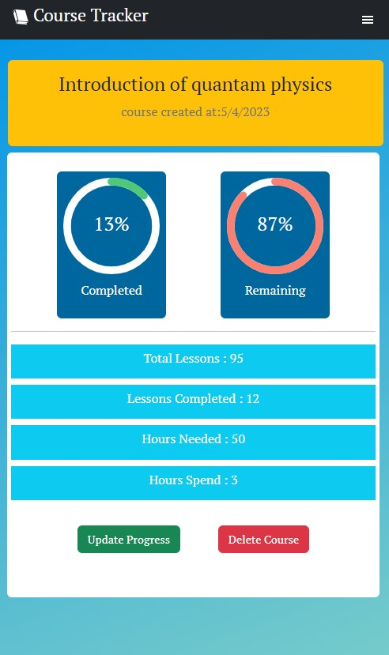

# Course-Tracker-Fullstack

This app was a part of microverse final capstone project. This app has been fixed and updated with MERN stack.The course tracker app provides a way to track details about courses a student is pursuing. New users must create an account in order to log in. Once authenticated, users can create new courses, can update their course progress, can see detail report of the courses he or she created. The api uses jwt authentication token to make user authentication. The app provides accumulated report of all the added courses so that students can measure their study progression. This app has an elegant, simple and user-friendly UI. It can be useful for the students who wants to track progression of different courses they are pursuing or pursued.

## Project Display




## Live Demo

[Course_Tracker]()

## Built With

- VsCode
- React
- redux toolkit
- express
- MongoDB
- NodeJs
- Bootstrap

# Getting Started

To get a local copy of the repository please run the following commands on your terminal:

```bash

$ git clone `https://github.com/ajkacca457/course_tracker_restructure.git`
$ cd course_tracker_restructure
$ Run `npm install` to install the necessary modules for server and api.
$ cd client
$ Run `npm install` to install node modules for front end.
$ Run `npm run dev` to start server.
$ Run `npm run start` to start client server.

```

# Authors

👤 **Avijit Karmaker**

- Github: [@Avijit](https://github.com/ajkacca457)
- Linkedin: [@Avijit](https://www.linkedin.com/in/avijit-karmaker-8738a54)

## 🤝 Contributing

Contributions, issues and feature requests are welcome!

## Show your support

Give a ⭐️ if you like this project!

## Copyright

This is a project developed by Avijit.
